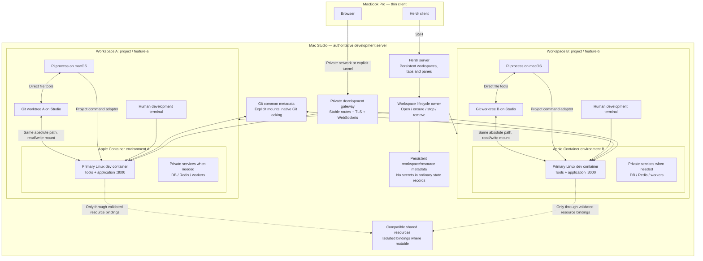

# Remote Development Architecture

**Mac Studio server · MacBook thin client · Herdr · Pi · Apple Container**

- **Status:** authoritative target architecture, not a description of the current implementation.
- **Baseline:** architecture agreed with the owner on 2026-09-09, incorporating the explicit requirement to retain Apple Container.
- **Purpose:** make opening a feature equivalent to opening a complete, persistent, low-friction remote development environment.
- **Change control:** implementation details may evolve within this contract. Changes to the fixed decisions below require explicit owner approval.
- **Scope of this document:** architecture and acceptance criteria only. Writing this document does not install, configure, migrate, or repair the existing system.

> The product is a development workspace for a feature. Containers are an implementation detail of that workspace, not a mode the user enables inside Pi.

## 1. Fixed decisions

1. All authoritative development work lives on the **Mac Studio**: repositories, worktrees, Pi processes, agent credentials, sessions, applications, tools, databases, persistent volumes, and workspace metadata.
2. The **MacBook Pro is a thin client**: Herdr over SSH and a browser. It does not need a repository checkout, application dependencies, a database, or a container runtime to use this workflow.
3. **Apple Container is the required runtime.** Docker Engine, Docker Desktop, Docker Compose, Colima, and OrbStack are not part of the target architecture. A Compose compatibility layer is not a prerequisite either.
4. **Herdr and Pi run together on the Studio host** in the initial implementation. This preserves the official local integration and straightforward file access. Moving Pi into a container is not an objective and must not become a prerequisite for correctness.
5. **One Git worktree is one feature environment.** Each managed worktree has one associated Herdr workspace and one primary Linux development container. Multiple Pi panes within that worktree share that environment.
6. Project shell commands from Pi and human development terminals execute in the **same primary development container**.
7. The Studio and development container expose project files at **the same absolute paths**, backed by the same worktree files. There is no second checkout and no synchronization loop.
8. Each feature has its own application process/network namespace. Several features can all use application port `3000` without competing for one host port.
9. Browser access uses **Tailscale and stable, feature-specific private HTTPS URLs under `herdr.test`**, not container IP addresses or manually assigned feature ports. Herdr continues to use SSH. Private DNS and gateway listeners use the Studio's Tailscale IP, discovered during setup, as explicitly selected by the owner; application configuration never contains that infrastructure address.
10. Mutable application state is isolated by default. Compatible resources may be reused automatically only when their isolation and ownership contracts permit it.
11. There is **one workspace lifecycle owner**. Pi, shell hooks, and Herdr must not independently implement container provisioning or cleanup.
12. Expected container execution **fails closed**. Failure to prepare or reach the development environment never silently reroutes project commands onto macOS.
13. Disconnecting a client is not stopping a workspace. Stopping compute is not deleting persistent data. Deleting a worktree is not implicit permission to erase its database.
14. The implementation must reduce custom code and eliminate duplicated decisions. It must not grow into a general-purpose container orchestrator.

The runtime decision above is a requirement, not a claim that Docker is universally slow or unsuitable for development. Performance must be measured against this workflow; no unsupported cross-runtime benchmark claim is part of the architecture.

## 2. User experience

The normal workflow is:

1. Connect from the MacBook to the Studio through Herdr.
2. Open a project feature using one action.
3. Wait for a bounded, visible preparation step only when needed.
4. Receive a ready Herdr workspace with Pi, a development terminal, service visibility, and browser links.
5. Work using ordinary commands, ordinary file paths, and the project's usual service ports.
6. Disconnect and reconnect without losing the running session.

Opening an already open feature focuses or attaches to its existing workspace. It does not create another worktree, container, database, or Pi session by accident.

The normal workflow does **not** require `.containerize`, `/container enable`, `/reload`, manual `container exec`, remembering VM IP addresses, selecting free application ports, installing dependencies on macOS, or choosing a sharing policy at every launch.

Project environment setup is declared once and then reused across worktrees. A first image build, dependency installation, or dataset initialization may take time; the architecture promises visibility and reuse, not zero-cost provisioning.

## 3. System diagram

The diagram is logical. The exact gateway product, private network, DNS zone, resource-provider implementation, and project configuration filename are implementation decisions, not additional approved dependencies.

## 4. Terminology and identity

| Term | Meaning |
|---|---|
| Project | One repository identity and its development environment definition. |
| Feature | A unit of work normally represented by a Git branch and worktree. |
| Worktree | The authoritative feature checkout stored on the Studio. |
| Workspace | The user-visible feature environment: worktree, Herdr association, compute, resource bindings, and routes. |
| Development container | The primary Linux container where project tools and application commands run. |
| Private service | A service instance owned exclusively by one workspace. |
| Shared resource | A managed resource whose capabilities permit reuse without violating workspace isolation. |
| Resource binding | A workspace's specific endpoint, namespace, credentials reference, and ownership relationship to a resource. |
| Stop | Stop the workspace's compute while retaining its files, bindings, and persistent data. |
| Remove | Retire the workspace and remove its checkout after safety checks; data purging is a separate, explicit decision. |

Identity rules:

- A workspace has a stable opaque ID; the display label and branch name are not that ID.
- Renaming a label does not rename resources or change ownership.
- A repository basename or remote basename alone is not a sufficient project identity.
- Branches such as `feature/a` and `feature-a` must never collapse to the same identity.
- Canonicalize the repository/worktree paths before identification, including symlink and path-case behavior on macOS.
- Store exact runtime IDs and Herdr IDs. Never reconstruct ownership by matching truncated names or parsing a human-readable table.
- Record one environment revision/fingerprint based on declared inputs. It identifies configuration drift, not every source-code edit.
- Automatic relocation of existing worktrees is outside the initial scope; detect a changed path and require an explicit repair/migration rather than guessing.

## 5. Component ownership

| Component | Owns | Must not own |
|---|---|---|
| Git | Branches, worktree registration, repository metadata and Git's internal locks. | Container or Herdr lifecycle. |
| Apple Container | Linux execution, images, runtime containers, supported networks, volumes and runtime inspection. | Feature identity or project policy. |
| Herdr | Terminal topology, live terminal persistence, agent display and supported session restore. | A second implementation of environment provisioning. |
| Official Herdr/Pi integration | Pi lifecycle reports and native Pi session references. | Container discovery, dependency installation or feature cleanup. |
| Workspace lifecycle owner | Workspace identity, preparation, exact resource bindings, readiness, stop/remove sequencing and recovery. | General cluster scheduling or arbitrary infrastructure deployment. |
| Pi execution adapter | Route project commands to the selected environment and translate execution results into Pi's tool contract. | Its own runtime registry, marker files, configuration precedence or cleanup algorithm. |
| Development gateway | Resolve stable private routes to currently ready application endpoints. | Ownership of databases or agent sessions. |
| Project environment definition | Required toolchain, services, preparation, readiness and application exposure. | A handwritten list of every dependency allowed to share. |

The lifecycle owner is initially a **small single-host CLI/library**, not a mandatory always-running custom daemon. Long-lived runtime services belong to Apple Container, Herdr, the gateway, or the service itself. Add a daemon only if a demonstrated requirement cannot be met reliably without one.

The terminal command name `wt` may be retained for familiarity. It is a thin user interface to the lifecycle owner, not a collection of independent shell subsystems.

## 6. Storage and path contract

### 6.1 Source code

- Repositories and worktrees are ordinary Studio files that remain usable if a container is stopped or deleted.
- Pi file tools access those files directly on the Studio.
- The development container mounts the selected worktree at its canonical Studio absolute path.
- The container's working directory matches the requested project directory, including subdirectories.
- No file synchronization service, duplicate Linux clone, or translation between `/workspace` and a host checkout is required.
- A user never installs macOS project dependencies into the mounted feature directory as part of this workflow.

### 6.2 Git

- Resolve the actual Git common directory using Git, not assumptions about `.git` being a directory or fixed `../..` traversal.
- Mount the common metadata at the absolute path referenced by the worktree's `.git` file.
- Provide the access required for intended Git commands, including writing objects/index/ref metadata when committing is supported.
- Do not mount the whole home directory or the entire main checkout merely to make a `.git` pointer resolve.
- Configure a consistent Git identity and narrowly scoped authentication deliberately; host credentials are not implicitly copied into containers.
- Native Git locking remains authoritative for Git operations. Worktree creation/removal is additionally serialized at repository lifecycle level.
- Mounting writable common Git metadata means sibling worktrees share a repository control plane. This is expected Git worktree behavior, **not** a strong security boundary between mutually hostile agents.

### 6.3 Project artifacts and temporary files

- Native dependencies and build artifacts are Linux artifacts, scoped to the workspace unless a tool documents a safe shared cache format.
- Shared download caches are distinct from installed dependency trees. Do not share `node_modules` by default.
- Use a Git-ignored, mounted workspace-local directory for tool-generated files that Pi's host file tools need to read.
- Route applicable temporary/artifact environment variables to that directory. Do not claim that host `/tmp` and guest `/tmp` are the same filesystem.
- Container-only `/tmp`, `/root`, and other unmounted paths remain guest-only. An execution adapter must export or spool required output to a host-readable path when necessary.
- Define and verify a non-root development-user/ownership strategy. Builds must not leave project files unusable by Pi or the Studio user.

### 6.4 Persistent service data

- Database data and other durable service state use named persistent storage or dedicated Studio-backed locations, not an expendable container writable layer.
- A resource's data identity is independent of a particular container instance.
- Rebuilding a development image must not erase a feature database.
- Volumes are not backups. Backups must include an application-consistent strategy appropriate to the service.

## 7. Execution contract: Pi and human terminals

Inside a managed workspace:

1. Pi's `bash` tool executes in the workspace development container.
2. Pi user `!` and `!!` commands use the same backend.
3. A normal development terminal enters that same container automatically.
4. Both receive the same project environment, service bindings, toolchain and working directory semantics.
5. Pi `read`, `edit`, and `write` act on the same Studio files mounted into that container.
6. Host administration remains an explicit, distinguishable action; it is never a fallback for a failing project command.

The adapter accepts a workspace identity and execution request, not an arbitrary container name guessed from the current path. It resolves subdirectories back to their managed worktree. It may request readiness through the lifecycle owner, but must not implement provisioning itself.

The exact affordance for starting an additional host-side Pi from a guest development terminal must be decided and tested. Acceptable solutions route through the existing Herdr/lifecycle owner; installing a second independent Pi stack in every container is not the default solution. The normal workspace action always opens the host-side Pi correctly without requiring the user to solve this distinction.

A Pi session outside a managed project can remain a normal Studio administration session. The UI and tool descriptions must make that mode explicit. A managed project whose environment fails is not reclassified into that mode.

### Cancellation and output

- Preserve stdout/stderr streaming, meaningful exit status, timeout semantics and cancellation.
- Timeout/cancellation must terminate the intended process or process group **inside the container**, not merely disconnect the host CLI client.
- Test child-process termination explicitly. An init/reaper helps with zombies but is not by itself a cancellation implementation.
- Interactive development terminals need real TTY behavior and signal forwarding.
- Background application services have explicit lifetimes and handles. They must not depend on an accidental detached child of a transient Pi command.
- Large output remains bounded for model context, with full output available through an explicit host-readable artifact path.

## 8. Apple Container runtime contract

Apple Container remains the sole container runtime in this architecture. Use native CLI/runtime interfaces rather than emulating Docker or rebuilding Compose compatibility.

During the audit, installed Apple Container `1.3.1` exposed CLI surfaces for container create/run/exec/start/stop/delete/inspect, labels, bind mounts, resource limits, networks, volumes, an init process, SSH-agent forwarding, and port publication. CLI availability does not establish all required behavior or interoperability; the acceptance suite must verify the subset actually used.

Implementation rules:

- Prefer structured inspection output to tabular text parsing.
- Identify resources using exact IDs plus ownership metadata supported by the runtime and the workspace record.
- Treat container addresses as transient endpoint information. Never use an IP as a persistent workspace identity.
- Use one primary development container per worktree. Add private service containers only where the project needs them.
- Reuse compatible existing containers. Recreate affected containers when immutable runtime configuration changes; do not pretend that restarting applies a new image or mount layout.
- Preserve persistent data during recreation and report any migration that cannot be automated safely.
- Start only required services. The absence of an application-specific database requirement must not start a database by default.
- Bound readiness and runtime operations so a broken service cannot hang workspace opening indefinitely.
- Do not expose the runtime control plane or a general host-command bridge to application containers.

Network and resource orchestration is deliberately limited to a **single Studio and finite project service requirements**. No scheduler, cluster API, rolling deployment system, universal service-discovery framework, or arbitrary dependency-graph language is required.

## 9. Project environment definition

Each project has one authoritative, versioned environment definition. Its exact filename and serialization format are not frozen here; use the smallest validated representation that satisfies actual projects.

It describes only what cannot safely be inferred:

- Development image/build inputs and toolchain requirements.
- Required services and compatible versions/options.
- Dependency preparation commands and the inputs that invalidate preparation.
- How each required service establishes readiness.
- Application entry points and exposed logical ports.
- Required secret references, not secret values committed to Git.
- Exceptional isolation requirements, such as a feature needing an exclusive database engine.

The system may discover obvious requirements from existing authoritative files, but must not invent requirements by scanning source code or infer safety merely because a package name appears in a manifest.

A service requirement is not a sharing allowlist. Projects declare **what they need**; the common resource policy determines **how safely to provide it**.

Preparation runs inside the Linux environment. Run it on first creation and when its relevant inputs change, not blindly before every Pi command or every Herdr attachment. Preparation failures block readiness and produce actionable logs.

Application processes may run in the primary development container under its normal process lifecycle, or in explicitly required service containers. Choose the simpler topology for the actual project; do not require one container per command or introduce a complex supervisor by default.

## 10. Automatic sharing without a dependency allowlist

### 10.1 Objective

The user should not maintain a global list such as “PostgreSQL may share, Redis may not, package X may share.” Nor should every feature launch trigger a sharing questionnaire.

Automatic reuse is based on **resource capabilities, compatibility and namespace ownership**, not on an AI's guess or a dependency-name allowlist.

### 10.2 Resource classes

| Resource class | Automatic default | Required evidence |
|---|---|---|
| Immutable image/layer | Reuse runtime-managed cached content. | Matching content identity and platform. |
| Immutable downloaded artifact | Reuse where the tool supports it. | Content integrity, compatible format and supported concurrent access. |
| Mutable build/download cache | Private unless safe shared operation is documented. | Supported locking/concurrency, correct cache keys and trust scope. |
| Installed dependency tree | Private to the worktree/environment. | No generic automatic sharing. |
| Application process | Private to the workspace. | No sharing merely because code/version matches. |
| Stateful service with enforceable per-workspace namespaces | Reuse a compatible managed engine when the provider can create an isolated binding. | Namespace, credentials, permissions, lifecycle and compatibility guarantees. |
| Stateful service without those guarantees | Private service instance. | Unknown safety defaults to isolation. |

### 10.3 Decision algorithm

For each declared requirement:

1. Resolve its concrete version/configuration and required isolation capabilities.
2. If an exclusive engine is requested, provision or reuse the workspace's private engine.
3. Otherwise search managed resources with compatible capabilities and ownership scope.
4. Reuse only if the provider can allocate the required isolated binding safely.
5. If no compatible resource exists, create a resource using the safe default supported by that provider.
6. If no provider can establish safe sharing, create a private service rather than asking the user to maintain a sharing exception list.
7. Persist the exact binding and inject its connection settings automatically into the workspace environment.

Compatibility includes service family/version requirements, platform where relevant, effective service configuration, required extensions/features, storage/namespace semantics, security scope and capacity. Do not reduce compatibility to an image tag or resource name.

### 10.4 Examples

**PostgreSQL:** a compatible engine may be shared while each workspace receives its own database and appropriately restricted role. Migrations target that workspace database. Tests requiring engine-wide settings, privileged extensions, disruptive server operations or incompatible versions receive a private engine. Separate databases alone are not a sufficient guarantee when the role has server-wide privileges.

**Redis:** numeric database selection or a naming prefix is not automatically adequate isolation. Reuse is permitted only when credentials/ACLs and supported application behavior enforce the necessary namespace and operation boundaries. Otherwise allocate a private Redis instance.

**Package downloads:** compatible, integrity-checked downloads may be reused through the package manager's supported cache. This does not authorize sharing a mutable installed dependency directory between worktrees.

### 10.5 Implementation boundary

Safe automation requires service-specific knowledge for operations such as creating a database and role. That knowledge belongs in a small, centrally maintained resource provider when an actual requirement justifies it. It is not a per-project dependency allowlist, and it must not turn into a speculative plugin framework.

The first version may provide private services for unsupported providers. It must not promise universal automatic safe sharing of arbitrary dependencies. Adding a sharing provider must preserve all existing isolation tests.

Existing “global” services are not automatically adopted just because they are discoverable or reachable. They must expose an explicit managed binding or be registered once with a validated contract. Reading arbitrary services, reusing their admin credentials, or mutating an existing global database is forbidden.

Shared resources outlive an individual consumer. Stopping/removing workspace A must not stop or erase a resource still bound to workspace B. Resource reclamation requires exact ownership and a verified absence of live bindings; “no running containers” alone is not evidence that persistent data is unused.

## 11. Network and localhost contract

### 11.1 Inside an environment

- Feature A and feature B can both run their application on `localhost:3000` in their respective primary containers.
- They do not both publish `0.0.0.0:3000` on the Studio.
- Multiple Pi panes belonging to the same feature intentionally share that feature's namespace; this is not per-agent isolation.
- Services in separate containers use stable logical endpoints injected into the environment, not assumed shared `localhost`.
- Apple Container name resolution/network behavior must be verified. Docker-style service DNS is not assumed to exist automatically.
- Each environment exposes only the required connectivity to private or shared services. Separate network names are not accepted as proof of access isolation without testing.

### 11.2 Browser access

The user sees stable URLs, for example:

- `https://feature-a.project.herdr.test`
- `https://feature-b.project.herdr.test`

The private zone is fixed as `herdr.test`; no purchased/public domain is required. These are illustrative labels: the implementation adds an identity suffix to avoid normalized-name collisions. Caddy's private CA issues HTTPS certificates; each intended client trusts its public root certificate, never its private key.

The Studio's Tailscale IP is the infrastructure address for private DNS and gateway listeners, not a feature URL. Ordinary reconnects/reboots retain that address. If deleting/re-registering the Tailscale device changes its IP, rerun host setup and update the tailnet split-DNS nameserver. Automatic recovery from a changed Tailscale identity is not implemented or promised.

A private gateway on the Studio maps a workspace ID and logical application endpoint to the current ready runtime endpoint. It refreshes routes after controlled restart/recreation and never treats a remembered IP as permanent. For out-of-band runtime changes, detect stale routes and show an unavailable state rather than accidentally routing to another feature.

Requirements:

- Accessible from the MacBook through **Tailscale**, as selected by the owner. Per-feature SSH browser tunnels are not the normal workflow.
- No public Internet exposure by default.
- DNS resolves to the appropriate Studio-side gateway, not to the MacBook's own loopback interface.
- TLS, WebSockets/HMR, redirects, API origins, cookies and allowed-host settings behave correctly.
- Stopped/unready features return an explicit unavailable response; they do not fall through to a different feature or silently start compute unless a later approved policy allows it.
- Herdr SSH attachment is terminal transport; browser connectivity is configured separately.
- Applications bind on an interface reachable by the gateway, or use an explicitly verified forwarding mechanism. A process listening only on guest loopback is not assumed reachable from outside the guest.

The user never edits container IPs or allocates host ports per feature. Internal dynamic endpoint allocation is allowed when hidden behind stable routes and exact ownership.

## 12. Herdr and Pi integration

- Herdr is the persistent server-side terminal manager. The MacBook attaches as a client over SSH.
- Use the official Pi integration for lifecycle events and native session identity; do not infer working/idle/blocked from a literal spinner string.
- Pi UI customization must not affect Herdr's understanding of whether the agent is working or waiting for the user.
- One managed feature maps to one Herdr workspace. Additional Pi panes or development terminals attach to that same environment.
- Store returned Herdr identifiers; do not predict them from sidebar positions or numeric patterns.
- Background creation preserves focus unless the requested action explicitly opens/focuses that workspace.
- Adopt/create workspace topology through the lifecycle owner's single entry point. Do not leave two independent “create worktree” implementations with different environment behavior.
- Herdr-native actions used for managed development must delegate to the same owner or be clearly outside the managed workflow until integrated.
- Pi session restoration and environment restoration are related but distinct: the Pi session reference identifies the conversation; the workspace ID identifies its development environment.

Disconnecting from Herdr preserves live server-owned processes. A full Herdr server restart or Studio reboot cannot preserve ordinary process memory; it requires supported session restoration and environment readiness checks. Never describe restored layout alone as restored development state.

## 13. Lifecycle and public operations

The proposed user-facing surface is deliberately small:

| Operation | Contract |
|---|---|
| `wt open <feature>` | Resolve/create exact worktree, prepare/reuse its environment, create/attach Herdr workspace, expose ready Pi/terminal/links. |
| `wt stop <feature>` | Stop feature compute gracefully; preserve checkout, session references and durable service data. |
| `wt remove <feature>` | Safety-checked retirement and worktree removal; retain data unless deletion was explicitly authorized. |
| `wt status` | Show actual workspace readiness, agent status, services, routes and actionable failures. |

These commands are a target interface, **not a claim about commands currently installed**. Additional internal operations such as `ensure`, `exec`, `rebuild` or repair may exist without becoming a second competing workflow.

### 13.1 Open

1. Resolve canonical project/worktree identity and acquire the appropriate lifecycle lock.
2. Validate project trust, definition, paths, ownership and runtime availability before executing project-controlled setup.
3. Create/register a worktree if needed, without unsafe name collisions.
4. Resolve the environment revision and resource requirements.
5. Reuse compatible resources or create precisely owned replacements.
6. Establish mounts, credentials references, bindings and environment variables.
7. Start required services and wait for their actual readiness checks.
8. Prepare project dependencies inside Linux when necessary.
9. Create/update private routes for ready applications.
10. Attach/create the Herdr workspace and host-side Pi/development terminals through one normal user action.
11. Report readiness or a specific recoverable failure; do not report success merely because a container process exists.

Progress may be visible in a workspace before preparation finishes. Project execution remains blocked until its prerequisites are satisfied. A workspace can be ready for coding without the application process running if the project deliberately starts the app on demand; the status must distinguish those states.

### 13.2 Stop

- Stop accepting new project executions during the transition.
- Resolve active sessions/tasks and avoid abruptly destroying work hidden behind another pane.
- Stop application processes and workspace-private services gracefully.
- Stop the primary development container and remove/disable active gateway routes.
- Keep shared engines needed by other workspaces running.
- Preserve all worktree files and intended persistent state.
- Reflect stopped state accurately in the workspace status; a stale green container badge is not acceptable.

### 13.3 Remove

1. Resolve exact identities, dependent resources and live consumers before deleting anything.
2. Detect dirty/untracked files, unpushed or otherwise valuable branch state, active agents and pending operations.
3. Require an explicit decision where removal would destroy work. No default `rm -rf` fallback after Git refuses removal.
4. Capture context and perform required pre-removal actions while the worktree still exists.
5. Gracefully close/stop relevant agent and compute processes.
6. Remove exactly owned containers, including stopped containers.
7. Release resource bindings according to their retention policy; preserve shared resources still in use.
8. Remove the Git worktree through Git. Preserve the branch unless branch deletion was explicitly requested.
9. Retire associated routes and Herdr topology, handling multiple panes consistently.
10. Record retained data with an explicit owner/retention record or erase it only under separately confirmed purge semantics.

There is no broad runtime prune in normal workspace cleanup. Deleting by a slug prefix, stale path guess or wildcard is forbidden.

## 14. Readiness, errors and concurrency

The minimum observable states are: **preparing**, **ready**, **stopping**, **stopped**, **failed**, and **removing**. These describe workspace compute readiness, not Pi's separate working/idle/blocked status.

- Serialize conflicting lifecycle operations per workspace and resource. Repository-wide operations use a repository-level lock where necessary.
- Concurrent `open` calls converge on the same workspace and resources.
- Serialize shared-resource allocation/namespace creation so simultaneous feature opens cannot allocate the same binding twice.
- Persist identity/ownership changes atomically. No secrets in routine metadata or logs.
- Failures retain enough structured information to retry or repair safely.
- Roll back only resources created by the failed operation and known not to be shared or valuable. Do not delete existing data to simulate a clean rollback.
- Reconcile records with actual runtime state after interruption. Do not blindly trust either stale local metadata or a similarly named container.
- Environment definition changes produce an explicit revision mismatch and controlled update, not silent reuse of an incompatible container.
- A missing runtime, failed service, unavailable secret or failed dependency installation blocks dependent execution with a specific recovery action.
- A broken project must never cause automatic host execution or service sharing across an unverified boundary.

## 15. Security and trust boundary

The primary goal is reliable development isolation: process namespaces, ports, dependencies and mutable state. This is **not** a claim of complete hostile-agent containment.

Pi runs with Studio-side permissions. Its host-backed file tools and the shared Git control plane require trust. A policy saying “host administration only” is not a technical restriction by itself.

Required safeguards nevertheless include:

- Respect Pi/project trust before honoring repository-controlled commands, runtime arguments, mounts or configuration.
- Do not mount the whole Studio home, broad credentials directories, runtime control sockets or arbitrary host paths by default.
- Pass only required environment variables and scoped secret references; do not forward the entire Studio shell environment.
- Use scoped Git/registry authentication and supported SSH-agent forwarding where validated. Do not copy private keys into images or worktrees.
- Shared service credentials grant only the workspace's intended namespace/operations.
- Development routes are private by default. SSH terminal access does not imply public service publication.
- Do not run unreviewed repository hooks on macOS during environment detection.

Strong confinement of Pi itself, strict file-tool path authorization and mutually hostile feature tenants would be a separate security requirement and may change the architecture. They must not be implied by the word “container.”

## 16. Performance and resource policy

- Keep warm environments reusable; do not rebuild/reinstall on every Pi session or terminal attachment.
- Keep application execution and data processing on the Studio; the MacBook only transports terminal UI and browser traffic.
- Use runtime image/layer caching and safe tool caches instead of sharing installed mutable artifacts.
- Start only required service instances, reusing eligible engines through the binding policy.
- Keep the hot command path small: resolve the ready workspace, execute, stream output, report status.
- Do not poll Git, runtime inventory or all services on every streamed model token.
- Do not hardcode undocumented performance targets or claim native-Linux-equivalent latency without measurements.
- Measure cold/warm open, command startup, file watching, HMR, dependency installation, test throughput, memory at representative concurrency, and resource cleanup.
- Define resource limits/capacity centrally for the Studio. Do not let opening many features silently exhaust memory or disk.
- Automated idle suspension is not required initially; introduce it only with explicit behavior for live agents, services and shared consumers.

## 17. Persistence, recovery and backups

| Event | Expected result |
|---|---|
| MacBook disconnect/sleep | Studio processes continue; reconnect to the same live workspace. |
| Pi exits | Container/services remain unless explicitly stopped; session reference remains available where supported. |
| Development container stops | Files/data remain; next explicit open/ensure restores readiness. |
| Development image rebuild | Replace compute, retain source and persistent data; rerun necessary preparation. |
| Herdr server restart | Restore topology and supported Pi conversations; verify environment association and readiness before project execution. |
| Studio reboot | After machine availability/unlock, restore Herdr first. Start feature containers and their required services only when that feature is opened. Retain session references and persistent data; do not automatically restart every previously active environment. |
| Workspace removal | Preserve unrelated features and shared resources; retained data remains identifiable. |

A macOS user LaunchAgent is a login mechanism, not a guarantee that everything is usable before user login or FileVault unlock. The actual headless startup sequence must be documented and tested on the Studio.

Back up source repositories/worktrees as appropriate, Pi sessions/configuration, workspace identity/resource-binding records, and persistent service data. Store secrets using an appropriate protected mechanism and recovery procedure. Avoid treating image caches or disposable containers as the authoritative copy of development work.

## 18. Maintainability constraints

- One authoritative place for identity derivation, lifecycle decisions, sharing policy and project configuration validation.
- Prefer native Git, Herdr and Apple Container operations over reimplementing their state machines.
- Maintain narrow adapters only at real external boundaries.
- Use named structured records rather than positional `path|branch` strings as internal domain state.
- Prefer exact resource IDs and validated paths to shell regexes and name reconstruction.
- Keep shell aliases trivial. Move meaningful lifecycle logic into one testable implementation rather than many interacting zsh helpers.
- Avoid a generic plugin/hook framework unless actual projects require extensibility that ordinary project preparation/service definitions cannot express.
- Do not create a second orchestrator inside Pi. Do not install a separate mandatory supervisor daemon merely to glue together commands.
- Version/probe external interfaces and fail with a clear compatibility error when an unsupported runtime/Herdr behavior is encountered.
- Any abstraction must make the next supported project simpler, not just distribute existing complexity across more files.

## 19. Existing mechanisms to retire

Once the replacement passes acceptance tests, retire the corresponding current mechanisms rather than leaving both active:

- `.containerize` activation markers and per-session enable/reload rituals.
- Competing `wt new` and `wt spawn` initialization paths.
- Host-side background `pnpm install` hooks.
- Container creation/restart/configuration ownership inside the Pi sandbox extension.
- Name-pattern cleanup and human-table runtime parsing.
- Silent sandbox failure fallback to macOS.
- Duplicated configuration/activation decisions across hooks and extensions.
- A textual Herdr agent-state fallback as the primary integration for customized Pi UI.

Keep working Pi UI customizations unless they conflict with the execution contract. The official Herdr integration replaces lifecycle guessing; the architecture does not require removing useful UI customization.

## 20. Acceptance tests — definition of done

These tests are mandatory behavior checks. Passing unrelated UI unit tests is not evidence that the environment workflow works.

### A. Basic workflow

- [ ] Open a fresh feature through one action and receive a correctly associated Herdr workspace, Pi and development terminal.
- [ ] Open the same feature twice, including concurrently; reuse exactly one worktree/environment/workspace.
- [ ] Open from a worktree subdirectory; resolve the same environment and preserve the requested cwd.
- [ ] Verify branch/path collision cases, including `feature/a` versus `feature-a` and equal repository basenames.
- [ ] Start an additional Pi pane and terminal in the feature without creating a second container or asking the user to manage host/guest paths.

### B. Files, tools and Git

- [ ] Pi and the development terminal read/write the same files at the same absolute paths.
- [ ] Compiler/test output paths can be opened by Pi without translation.
- [ ] Mounted temporary artifacts and full command logs are host-readable when promised.
- [ ] Git status, diff, commit and intended authentication work from the containerized worktree.
- [ ] Concurrent sibling-worktree Git operations do not corrupt repository state.
- [ ] Dependencies install in Linux only; host-native binaries are not introduced by opening a feature.
- [ ] File watching and HMR respond to Pi edits on the Studio mount.
- [ ] User/group permissions permit normal editing and rebuilding without repair commands.

### C. Services and sharing

- [ ] Two features run the same application port simultaneously without host publication conflicts.
- [ ] A migration in feature A leaves feature B's mutable data unchanged.
- [ ] Compatible shared resources receive distinct, appropriately restricted workspace bindings.
- [ ] An unsupported/unsafe sharing capability automatically results in a private instance, not an unsafe guess.
- [ ] Incompatible versions/settings do not accidentally reuse one engine.
- [ ] Removing one consumer cannot stop or delete another consumer's shared resource or namespace.
- [ ] An unrelated discovered global service is never silently adopted or mutated.
- [ ] No per-feature sharing allowlist or routine sharing confirmation is required.

### D. Browser and remote access

- [ ] Both feature URLs work from the MacBook and reach the correct applications.
- [ ] Routes remain correct after container recreation/address changes.
- [ ] TLS, WebSockets/HMR, redirects and application origin/cookie behavior work.
- [ ] Stopped/unready routes do not send traffic to a different feature.
- [ ] Private connectivity does not require exposing each development service publicly.

### E. Failure and lifecycle

- [ ] Runtime/startup/preparation failure never executes a project command on the Studio host.
- [ ] Timeout and cancellation terminate a long-running guest child/process group, not just the host exec client.
- [ ] Stop accurately changes observable state and preserves persistent data.
- [ ] Rebuild applies changed image/mount/service configuration without destroying durable data.
- [ ] Remove works for running and stopped resources using exact ownership.
- [ ] Dirty/untracked work is protected; interactive selection cannot reverse branch/path fields or delete an unrelated directory.
- [ ] Removing the current worktree does not lose the context needed for cleanup.
- [ ] Interrupted/concurrent operations recover without duplicate ownership or destructive cleanup.
- [ ] Untrusted project configuration cannot introduce mounts/commands even when the extension is globally installed.

### F. Persistence and observability

- [ ] Disconnect/reconnect preserves the live Studio session.
- [ ] Herdr shows Pi working, waiting-for-user and idle correctly despite customized working indicators.
- [ ] Herdr restart restores supported Pi conversations, not merely tab layouts.
- [ ] Studio reboot/unlock recovery follows the documented policy and re-establishes correct workspace bindings/routes.
- [ ] Retained data remains discoverable after workspace retirement.
- [ ] A documented restore procedure recovers selected work and database data from backup.

## 21. Delivery plan

### Phase 1 — prove the vertical slice

The owner selected `/Users/walid-mos/Development/nextnode/fitApp` as the reference project. Its inspected manifests describe a Node >=24 / pnpm 11.21.0 / Turborepo monorepo with an Astro/React frontend, a Hono API running through Wrangler, and a local Cloudflare D1 binding. The frontend uses a Cloudflare service binding to the API; preserve that integration rather than replacing it with an arbitrary peer URL. An MCP package also exists but is not started by the root `pnpm dev` task merely by its presence.

Use two disposable worktrees with Apple Container, host-side Pi/Herdr and development terminals. Use isolated local D1 emulator persistence as the first mutable-state test; do not introduce PostgreSQL or Redis merely to match an earlier generic example. Local database initialization/fixtures must be explicit preparation, never an implicit production migration or remote D1 operation. Validate Wrangler/workerd support on Linux ARM64, cross-worker service binding discovery within each environment, authentication origins and frontend HMR. The current local `SITE_URL` points to `http://localhost:4321` and must receive the correct workspace browser origin through deliberate development configuration. Prove path parity, Git, port coexistence, independent state, guest process cancellation, and MacBook browser access before replacing the existing workflow.

### Phase 2 — consolidate ownership

Introduce the small lifecycle owner and thin Pi execution adapter. Wire Herdr workspace actions to that owner, install/verify official Pi lifecycle integration, and implement exact identities, guarded stop/remove and bounded readiness.

### Phase 3 — add safe automatic resource reuse

Start with runtime image reuse and safe caches. Add only the stateful providers justified by real projects. Reuse compatible engines through isolated bindings; unknown cases remain private. Demonstrate that no per-feature allowlist maintenance is necessary.

### Phase 4 — recovery and migration

Validate interrupted operations, runtime/Herdr upgrades, Studio reboot behavior and backup restoration. Migrate existing state deliberately, then remove superseded hooks/extension behavior. Do not run old and new lifecycle owners concurrently against the same resources.

The architecture is fixed; implementation starts with a proof of the hardest boundaries, not a broad rewrite or a generic orchestration platform.

## 22. Decisions still requiring implementation validation

These open decisions do not reopen the fixed architecture:

| Decision | Required outcome |
|---|---|
| Exact Apple Container network topology/name resolution | Stable logical service endpoints and verified access boundaries. |
| Lifecycle implementation language/state location | Small, testable, transactional single-host implementation. |
| Project definition filename/schema | One validated source of requirements without duplicated configuration systems. |
| Development image and user/permission setup | Linux tooling, fast reuse, correct mounted-file ownership. |
| MacBook DNS and TLS verification | Tailscale, the private `herdr.test` zone, Caddy internal CA and IP-based infrastructure listeners are selected. Verify client split DNS and certificate trust. Gateway-to-container traffic uses native Apple Container Unix-socket publication, not VM IPs. |
| Guest process supervision/cancellation mechanism | Reliable signal propagation and no orphaned timed-out commands. |
| First supported shared-service providers | Proven namespaces, credentials, compatibility and retention semantics. |
| Opening host-side Pi from guest terminals | No accidental second agent installation or manual host/guest choreography. |
| Git authentication and secret delivery | Scoped, non-embedded credentials with documented recovery. |
| Startup/reboot implementation | Policy is fixed: Herdr first after login/unlock; feature environments start when opened. Validate how Pi restoration is deferred or gated so automatic agent restore does not start every environment. |
| Persistent data retention/purge UX | No accidental data loss or anonymous orphaned volumes. |
| Resource limits and performance targets | Measured on the Studio at representative feature concurrency. |

## 23. Final architecture statement

> The Mac Studio is the complete development machine. The MacBook is its terminal and browser client. Herdr presents persistent feature workspaces; Pi remains beside Herdr on the Studio for direct file access and reliable native integration. Each worktree receives an Apple Container Linux development environment with its own application namespace, shared file paths, isolated mutable state, and stable private browser URLs. A small, single lifecycle owner connects Git, Herdr, Pi and Apple Container. Compatible resources are reused automatically through explicit capability and ownership contracts, not dependency allowlists or guesses. Opening, stopping and removing a feature are coherent user actions; no container ritual or duplicated orchestration is exposed to the user.
