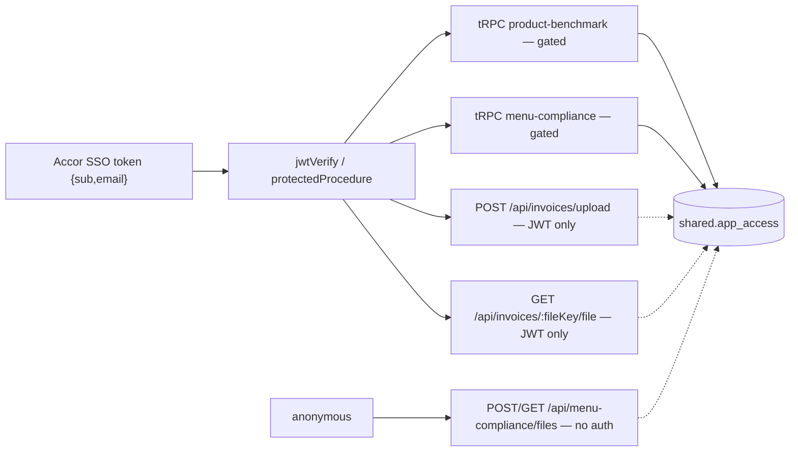

# PR #228 cross-app access — review remediation

## Goal

PR #228 mergeable: every entry point enforces the new grant, no access/data loss on deploy,
Menu Compliance grant vocabulary expresses the roles Menu Compliance actually has.

## Context

- PR accor-hotels/product-data-apps#228 `feat: cross-app access management`, author AccorCorentin,
  base `develop`, head `992f07a`, +13 148 / −8 112, 154 files. I am the reviewer.
- Review pass 2026-09-16 static, against head `992f07a` (local worktree branch `163c196`, 1 commit
  behind). Snapshot `product-data-apps/feat/cross-app-access-management/.review228/head`, diff
  `.review228/diff.patch`. Test suite not executed.
- New model: `shared.users` / `shared.app_access` / `shared.access_requests`; `adminProcedure`
  = `is_super_admin`; per-app admin routers on shared grant commands.
- Grant lookup exists only in tRPC procedures (`product-benchmarking/access.procedure.ts:21`,
  `menu-compliance/backoffice.procedure.ts:44`); no global fastify hook (`grep addHook` → only
  `onClose`/`onListen`).
- `menu_compliance.whitelisted_emails` dropped by `migrations/0028_bizarre_switch.sql`; zero
  `INSERT` in `apps/api/migrations/*.sql`; deleted `seed-whitelist.ts` ran for local+dev only.
- Bootstrap super-admin seed is `localOnly` (`db/seed/shared/seed-admin.ts:27`); PR body lists
  prod admin + `PORTAIL_*` envs as unchecked.
- Menu Compliance writes `scope.level`, never reads it (repo-wide grep); `drizzle-user-access.source.ts:42`
  defaults segment to `pme`; `menu-compliance/admin.router.ts:19` pins role `backoffice`.
- Findings: 2 blocking + 4 P1 + 5 P2 (P0-2 withdrawn — greenfield). Posted inline on #228 on
  2026-09-16; detail carried in the phases below, one place each.

## Architecture

Caption: which entry points reach the new grant guard today, which bypass it.

Dotted = no grant lookup. U1/U2/U3 are the three entry points this remediation closes.

## Approach — phases

### 1. Close the three ungated entry points

- P0-1: `product-benchmarking/invoices-upload.route.ts:41` and `invoices-file.route.ts:16` use
  `{ preHandler: fastify.authenticate }` only; the grant check lives in `access.procedure.ts:21`.
- Extract one `assertAppAccess(db, user, 'product-benchmark')`; call it from the procedure and both
  `preHandler`s — routes must not re-implement auth.
- P0-3: `menu-compliance/menu-compliance-files.route.ts:15,31` fully unauthenticated (client-supplied
  `mimetype` stored, served back `inline`); gate it, or delete it — the front never calls it
  (`grep` in `apps/menu-compliance/src` = no caller).
- Decision locked: denial is 403 `FORBIDDEN` (front routes on `FORBIDDEN`/`UNAUTHORIZED`, not 500).

Gate: ungranted + anonymous curl on all three routes → 401/403; granted → 200.

### 2. Whitelist drop — no backfill (withdrawn 2026-09-16)

- Withdrawn: the project is greenfield, there are no hand-filled `whitelisted_emails` rows worth
  preserving, so `0028_bizarre_switch.sql:1`'s `DROP TABLE … CASCADE` ships as-is. P0-2 is off the
  list; the plan no longer carries a backfill migration.
- Kept: the PR description still claims the whitelist is untouched (stale since `4a1ff87`) — raised
  on the PR as a note, not as a blocker.

Gate: none — nothing to reconcile.

### 3. Make the Menu Compliance grant vocabulary match the product

- P1-5: `scope.level` (`admin`/`superadmin`) is inert and its words collide with the portail's
  `is_super_admin`, which really does gate `/admin`. Decided: it is a **test-account flag** →
  `scope: { accountType: 'standard' | 'admin_test' }`; the key stops claiming a privilege ladder and
  `superadmin` disappears from grant vocabulary (`admin.router.ts:20,32`,
  `portail/entities/admin/model/types.ts:18`). When the flag ships it is enforced **where the extra
  data is read** (server-side query filter), never as a front-end hint.
- P1-6: segment must leave the access path. Delete the `: 'pme'` stand-in
  (`drizzle-user-access.source.ts:39-43`) and the comment that calls segment a data-mart concept
  while fabricating one. Segment stays nullable for back office (`user-access.ts`), sourced from the
  Snowflake data mart (not built yet → explicit dev-only mock, returns `null` when unknown); missing
  segment stays fail-closed — `resolve-segment.ts:8-9` → `BAD_REQUEST`, `pmeBackofficeProcedure`
  (`backoffice.procedure.ts:57`) → `FORBIDDEN`. No fallback, ever.
- P1-7: the access surface manages `backoffice` only (`admin.router.ts:18`). Filter `listRequests`
  (`admin.router.ts:58`) to backoffice and stop the request path from offering `hotel`: an operator
  must not see a `hotel` row whose approve button silently writes a back-office grant. Hotel
  whitelisting is explicitly out of this PR (owner: us, later).

Gate: no `'pme'` fallback left in the MC access path; an unknown-segment back-office user reaches the
app and gets `FORBIDDEN` on PME-only settings; the admin list shows backoffice requests only.

### 4. Rollout prerequisites (runbook, no code)

- P1-4: PB had no grants before this PR → day-1 nobody has access; first super-admin only via SQL;
  `PORTAIL_*` envs unprovisioned.
- Order to document and own: migrate → backfill → seed admin → grant PB → deploy.
- Written where it survives the PR (README/env docs), owner named per environment.

Gate: dry-run on a prod-like DB — PB user reaches home, back-office user reaches `/backoffice`,
`/admin` usable.

### 5. Hygiene batch (P2)

- P2-8: guard falsy `ctx.user.email` before `.toLowerCase()` at `shared/admin.procedure.ts:9`,
  `shared/admin.router.ts:26`, `product-benchmarking/access.procedure.ts:14` (else 500, not 403);
  same codebase already tolerates a missing email (`invoices-upload.route.ts:129`).
- P2-9: prove the snapshot chain after 7 rewritten `migrations/meta/*_snapshot.json`
  (`0012` is a full-file rewrite): no-op `drizzle-kit generate` must produce an empty migration.
- P2-10: docs drift — `README.md:13,228`, `apps/menu-compliance/AGENTS.md:141`,
  `shared/access-request.router.ts:15`, `portail/entities/admin/api/index.ts:15`.
- P2-11: add `revoked_by_user_id` to `shared.app_access` + write it in `revoke()`
  (`drizzle-access-grant.repo.ts:85`) — "who revoked this" is currently unanswerable.
- P2-12: decide portail i18n — catalogue like the other apps, or documented exemption (today: FR home
  + EN admin + `Oui`/`Non` in one flow).

Gate: `pnpm typecheck && pnpm lint && pnpm test` green on api, portail, menu-compliance,
product-benchmark; no stale `whitelist` reference outside `migrations/`.

### 6. Re-review on the author's next push

- Re-read changed hunks only; re-run the phase-1 probes.
- Confirm or reject each P0/P1 with dated evidence in this plan.

Gate: every P0 closed; every P1 closed or deferred with a named owner.

## Files touched

| Area | Files |
| --- | --- |
| api routes | `apps/api/src/product-benchmarking/invoices-{upload,file}.route.ts`, `apps/api/src/menu-compliance/menu-compliance-files.route.ts` |
| api access | `apps/api/src/product-benchmarking/access.procedure.ts`, `apps/api/src/shared/admin.procedure.ts`, `apps/api/src/shared/admin.router.ts` |
| migrations | `apps/api/migrations/0028_bizarre_switch.sql`, `migrations/meta/*` (no backfill — greenfield) |
| menu-compliance | `apps/api/src/menu-compliance/admin.router.ts`, `repositories/drizzle-user-access.source.ts`, `domains/access/{user-access,resolve-segment}.ts`, `apps/api/src/shared/repositories/drizzle-access-grant.repo.ts`, `apps/api/src/shared/access-request.router.ts` |
| portail | `apps/portail/src/pages/admin/**`, `apps/portail/src/entities/admin/model/types.ts`, request form role offer |
| segment source | new data-mart-backed segment lookup + explicit dev mock (replaces the `'pme'` default) |
| docs | `README.md`, `apps/menu-compliance/AGENTS.md`, 2 inline comments |

Boundary: no Terraform/`infra/`, no product-benchmark front rewrite, no change to
`hotel.procedure.ts` or the hotel-code model, no role/segment source moved into the JWT.

## Decisions (settled with the owner, 2026-09-16)

- `scope.level` is a **test-account flag**, renamed `accountType: 'standard' | 'admin_test'`;
  enforced server-side where the extra data is read, when the flag ships. The portail's
  `is_super_admin` stays the single administrator concept — no tier words in app grants.
- **Segment belongs to the data layer** (Snowflake data mart, not yet built → explicit dev mock),
  never to `app_access`; the `'pme'` default is removed with no replacement fallback.
- The access surface is **backoffice-only**; hotel whitelisting is out of scope for this PR.
- **Owner: findings touching Menu Compliance are fixed by us** on the branch. Product Benchmark
  items (P0-1 invoice routes, PB doc drift) go to the author — to confirm.
- Menu Compliance is **greenfield**: nothing to backfill when the whitelist table is dropped.
- **Review posted on #228** (2026-09-16, head `992f07a`): 10 inline comments + 1 top-level scope
  question. The two pre-existing ungated REST routes and the doc drift live in the top-level
  comment, not as blockers.

## Open questions

- ~~Publish the findings?~~ Done 2026-09-16: full inline review on #228 (10 inline + 1 top-level).
- Author's answer awaited on the top-level scope question: the two ungated pre-existing REST routes
  and the doc drift — this PR or a follow-up.
- Which query carries the tester filter when `accountType` ships, and which data it adds — needed
  before the flag is implemented, not before merge.

## Steps

1. Fix on the branch ourselves: phase 3 (`accountType`, segment source, backoffice-only request
   list) and the MC files-route gap — Menu Compliance is ours. No backfill (greenfield).
2. Hand the Product Benchmark items (P0-1 ungated invoice upload/preview, PB doc drift) to the
   author with file:line evidence; ask him to reconcile the stale PR description.
3. Diff the `level` → `accountType` rename across api + portail; no reader of the old key may remain.
4. Document where the tester filter will live, even though the flag ships later.
6. Have the rollout runbook land in repo docs; verify env + admin prerequisites for dev/préprod/prod.
7. Re-check the P2 batch (email guard, snapshot chain, docs, `revoked_by_user_id`, portail i18n).
8. Pull the author's next push; re-run the three probe curls + `pnpm test` per filter.
9. Record gate outcomes below; move `status` to `review` once P0 is empty.
10. Close on merge or on deferral with owners → `status: done`, move under `done/<year>/`.

## Verification

| Gate | Result | Status |
| --- | --- | --- |
| Phase 1 — three routes 401/403 without grant, 200 with | | pending |
| Phase 2 — withdrawn (greenfield, no rows to copy) | | n/a |
| Phase 3 — no `'pme'` fallback, unknown segment fail-closed, backoffice-only request list | | pending |
| Phase 4 — runbook dry-run (PB + backoffice + `/admin`) | | pending |
| Phase 5 — typecheck/lint/test green, no stale whitelist refs | | pending |
| Phase 6 — all P0 closed on next push | | pending |
