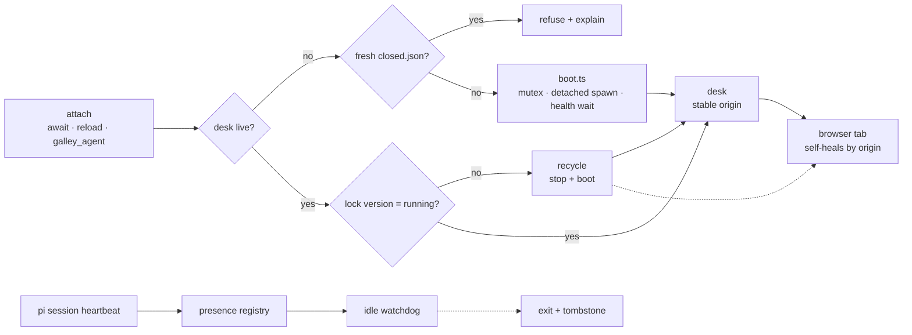

# Start-free, update-free desk lifecycle

## Goal

Attaching boots the desk: `galley await`, `galley reload`, and `galley_agent attach` never fail on "no desk"; stale-version desks recycle on attach; desk exits when the last pi session and the tab are gone. No manual start/stop/update, no daemon.

## Context

- Attach hard-fails when no desk: `src/agent/desk-connection.ts` (`No Galley desk for …`), `runAwait`/`runReload` exit 1 — `src/cli/commands.ts`.
- `runDesk` already idempotent: live repo+session desk → reload in place — `src/cli/launch.ts`.
- Lock = pid/url/session/startedAt; dead pid swept on read — `src/state/desk.ts`.
- `serveDesk` binds `stablePort(root, session)`; `startServer` falls back to a **random** port when held → double-boot race hazard — `src/cli/desk-serve.ts`.
- Idle watchdog: interval check, in-flight requests pin; default 120 min — `src/server/shutdown.ts`.
- Attached pi listener long-polls `/api/await-send` → pins desk while attached — `src/agent/desk-connection.ts`.
- Extension already hooks `session_start`/`session_shutdown`; pi also fires shutdown on fork/switch → ghost unregisters need TTL — `src/agent/pi-bridge.ts`.
- Contract (`galley spec`, v0.7.4): after `closed`, never blind-restart; subcommands auto-target the lone live desk; stdout stays tagged JSON.
- Update check runs only at explicit desk start, TTY-only — `src/update.ts`.
- `prompts/plan.md` + `review.md` still boot via `nohup … > /tmp/… & sleep 2`; supersedes repo-local draft `.pi/galley/plans/desk-auto-boot-presence.md`.

## Architecture

Caption: what boots a desk, what recycles it, what lets it die.

## Approach — phases

### 1. Closed tombstone (prerequisite)

- Write `<reviewDir>/closed.json` `{closedAt, reason}` on every desk exit: browser Close (`src/server/routes/agent.ts`), idle shutdown, explicit stop (`installExitHandlers`).
- Delete on desk start; explicit `galley` start always proceeds.
- Auto-boot refuses a tombstone younger than 24 h, stderr one-liner naming the explicit restart.
- Rationale: turns the spec's "don't blind-restart a closed desk" rule into a mechanism.

Gate: test — fresh tombstone refuses boot, stale boots, explicit start clears.

### 2. Detached boot primitive

- New `src/cli/boot.ts`: `bootDesk(root, session, opts)`.
- Probe 1: lock + `deskAlive`; probe 2: constructed `stablePort(root, session)` URL — covers crash-lost lock.
- Boot mutex: `reviewDir/boot.lock` mkdir token, pid-checked, ~15 s TTL, swept on failure → concurrent booters serialize; loser re-probes.
- Spawn detached `process.execPath` + running CLI entry, `--session`/`--host`/`--idle-timeout`/`--no-open` passthrough, stdio → `<reviewDir>/boot.log`, `unref()`.
- Bounded wait (~10 s, 250 ms) on `deskAlive`; boot messages on stderr only.
- Rationale: attach callers must not inherit the persistent server; the mutex kills the random-port twin.

Gate: two concurrent `bootDesk` → exactly one new pid, both callers proceed.

### 3. Wire boot-on-miss

- `runAwait`, `runReload`, `connectDesk` call `bootDesk` before reading the lock; refusal message carries the tombstone explanation.
- `comment` (offline fallback) and `status` (ephemeral, `{live:false}`) deliberately untouched.
- Opt-out `GALLEY_NO_AUTO_BOOT=1` for CI.

Gate: `await` with no desk boots and receives a real event.

### 4. Version handshake

- `serveDesk` stamps `version` (`currentVersion()`) into the lock; `DeskLock.version?` optional.
- Export `parseVersion` (`src/update.ts`); attach compares: lock version strictly older → recycle (HTTP shutdown → boot step 2); equal → no-op; unparseable (dev builds) → warn only.
- `GALLEY_NO_RECYCLE=1` disables; `maybeOfferUpdate` stays TTY-only at explicit start.

Gate: older lock version → recycle rebinds the same port with review state intact.

### 5. Presence

- New `src/server/presence.ts`: in-memory `{sessionId → lastSeen}`, reaper on the watchdog tick, active = age < TTL (4 min).
- Routes `POST /api/presence {sessionId, ttlMs?}` / `DELETE /api/presence {sessionId}` (loopback, no UI surface yet).
- Watchdog `isIdle()` requires zero active presence.
- Extension: new `src/agent/presence.ts` client; 60 s heartbeat from `session_start` and on attach; best-effort DELETE on `session_shutdown`; TTL covers SIGKILL.

Gate: watchdog idles only when registry empty; reheat after simulated sleep.

### 6. Contract + prompts + docs

- `src/spec.ts`: start-free attach, tombstone refusal, recycle notice, presence endpoints.
- `prompts/plan.md` + `review.md`: drop nohup/sleep step → "attach; desk boots itself; report URL".
- Update the two "start it first" error strings; `skills/galley/SKILL.md` stays bootstrap-only.

Gate: spec tests pass; prompt text matches `galley spec`.

## Files touched

| Area | Files |
| --- | --- |
| Boot | `src/cli/boot.ts` (new), `src/cli/commands.ts`, `src/cli/desk-client.ts` |
| Lifecycle | `src/cli/desk-serve.ts`, `src/state/desk.ts`, `src/update.ts` (export only) |
| Attach | `src/agent/desk-connection.ts`, `src/agent/pi-bridge.ts`, `src/agent/presence.ts` (new) |
| Presence server | `src/server/presence.ts` (new), `src/server/routes/agent.ts`, `src/server/routes.ts`, `src/server/shutdown.ts`, `src/server.ts` |
| Contract + prompts | `src/spec.ts`, `prompts/plan.md`, `prompts/review.md` |
| Tests | `src/cli/boot.test.ts` (new), `src/server/presence.test.ts` (new), `src/cli.test.ts`, `src/server.test.ts`, `src/spec.test.ts`, `src/agent/pi-bridge.test.ts` |

Boundary: no UI change, no persisted-schema change, no portal/hub, no daemon, no version bump.

## Open questions

- Recycle vs reviewer's unsent browser draft — default: recycle ON, one-line stderr notice, `GALLEY_NO_RECYCLE=1` opt-out.
- Dev-checkout churn (rebuild → every attach recycles) — default: recycle only for parseable, strictly-older versions; else warn.
- Tombstone TTL 24 h — default: yes.
- Presence TTL 4 min vs laptop sleep — default: heartbeat reheat, no special casing (open tab keeps desk anyway).
- Boot mutex TTL 15 s — default: yes, with pid liveness check.
- Out-of-repo `galley file <path>` targets: desk roots at the file's directory, so `attach --repo <git root>` misses the lock (hit when relaunching this plan) — default: attach/probe derive the root exactly like the start command; phase 2 validates.

## Steps

1. Add `closed.json` write/clear + boot refusal path.
2. Add boot mutex + stable-port/lock probes in `src/cli/boot.ts`.
3. Add detached spawn + bounded health wait + `boot.log`.
4. Wire `await`/`reload`/`connectDesk` to boot-on-miss with env opt-out.
5. Stamp lock version, export `parseVersion`, add recycle path.
6. Add presence registry + routes, gate the idle predicate on it.
7. Add extension heartbeat client; hook `session_start`/`session_shutdown`.
8. Update `src/spec.ts`, both prompts, and the two error strings.
9. Add boot + presence tests; extend cli/server/spec/pi-bridge tests.
10. Run gates: lint, lint:types, format:check, check, test, build.
11. Verify manually: kill -9 → attach boots; recycle rebinds origin; last-pi exit within idle window.

## Verification

| Gate | Result | Status |
| --- | --- | --- |
| Tombstone refuses/boots/clears | | |
| Boot race → single pid | | |
| `await` boots on miss | | |
| Version recycle, state intact | | |
| Presence gates idle | | |
| Spec + prompts aligned | | |
| Repo gates + manual lifecycle checks | | |
