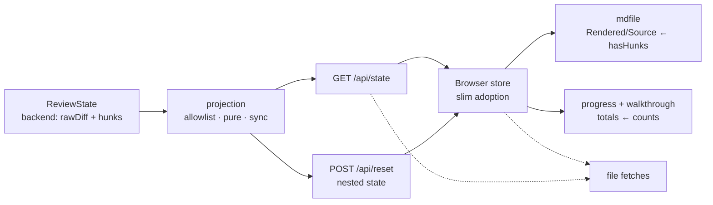

# Trim the browser state payload

**Implemented 2026-09-14 — ready for human code review.** Full-repo gates blocked only by unrelated pre-existing failures (see Verification).

## Goal

Large desks open/refresh faster: the browser receives the review's **index, not a second copy of every diff line** — it already fetches file contents separately for display. Review experience, saved decisions, staging, comments, agent handoff: all unchanged.

## Context

Benchmark (supplied, not rerun at plan time): large ≈ **125 MB** state response, **3.9 s** to first rows; medium **28 MB**. The ~1 s large cold-open target = hypothesis to test, never a gate.

Code inspection at `afce4c4`:

- `GET /api/state` serializes all backend state — `rawDiff` + every file's parsed hunks included.
- UI never reads backend `rawDiff`: the renderer rebuilds diffs from the separately fetched old/new contents.
- UI **does** read backend hunks in 3 spots: Markdown Rendered/Source default, completion line-counts, walkthrough fallback. Migrate before dropping the field.
- `POST /api/reset` returns full state too — slim it, or Reset re-imports the heavy objects.
- `/api/poll` stays a small heartbeat; add the approved refresh event for reconnected tabs.
- Backend keeps the full diff (staging + reconciliation) — **transport change, not persistence migration**.

Locked decisions (approved in the recovered Galley review, 2026-09-14):

1. **Reset included** — same slim projection on both response paths.
2. **Completion counts untouched** — hunkless-file totals stay as-is here; changing them is a separate behavior fix.
3. **Refresh event over the existing heartbeat** — detects a restarted desk. Persistent, non-destructive refresh-required notice; reviewer refreshes explicitly, after in-flight actions and unsaved text are safe. No forced navigation during stage/unstage/Send. Guard Reset's state adoption like GET state. Bundles predating the mechanism: manual refresh once, on first upgrade.
4. **No performance gate** — measure and report only; ~1 s / −80 % never block release. Does not address worker tokenization or DOM-cache memory.

## Architecture

Caption: what now crosses the boundary, what the UI hunks/readers consume instead.

## Approach — phases

### 1. Boundary contract

- Define `BrowserReviewState` / `BrowserReviewFile` in `src/types.ts`, next to backend types; reuse shared field types; `ReviewState` untouched.
- Build responses by **explicit allowlist** — never spread-and-delete; future backend fields must not leak onto the wire.

| Part | Backend → Browser |
| --- | --- |
| Review identity (`root`, `session`, `mode`, `target`, `staged`, `baseDiffHash`) | keep |
| File summaries (paths, hash, kind, ±counts, rename/oversize flags, optional size) | keep — counts required, stamped by existing builder, never recomputed |
| Parsed hunks | → required `hasHunks: boolean` |
| Reviewer records (changes, decisions, comments, approvals, staging lists, decision-file list) | keep |
| Guide + live agent status | keep (status outside stored browser review) |
| `rawDiff`, `id`, `repoHash`, `head`, `base`, state timestamps, `persistFile` | omit |

- Before making counts required: check alternate file builders, reloads, restored desks, preview-file construction.

Gate: every kept field has a consumer or contract reason; every dropped field has zero remaining browser readers. Backend `DiffHunk` ≠ renderer hunks — the latter stay untouched.

### 2. Server and browser move together

- One pure synchronous projection, shared by `GET /api/state` and the nested `state` in `POST /api/reset`.
- Preserve staged-snapshot refresh, mutation serialization, live-status handling; never delete from the authoritative state.
- Retype browser store, initial fetch, reload, reset, previews, affected helpers — no casts pretending slim = full backend state.
- Markdown reads `hasHunks`; walkthrough totals come from supplied counts, obsolete hunk fallback removed.
- Completion receipts preserved exactly: hunkless whole-file addition counts **zero lines** there vs nonzero sidebar additions — distinction reconstructed from summary + `hasHunks`.
- Unchanged: per-file content fetch, rendered hunks, decision replay, anchors, save/send ownership, `ReviewResult`.

Gate: UI + backend typechecks pass; both responses exclude the heavy fields; all operations work on slim state.

### 3. Lock behavior, document the boundary

- Contract tests failing-first, then pass:
  - `rawDiff` / hunk-line sentinels never appear in either response; backend still retains them after.
  - Required fields and meaningful zero/false values survive projection — incl. empty desk after reload.
  - Markdown defaults + line totals for modified / added / deleted / hunkless / pure-rename files.
  - Initial load, reload, Reset all adopt the same browser shape.
  - Accept/reject, approvals/staging, comments/questions/replies, guides/skims, save/send preserve records and semantics.
- Concurrency regression: keep its `hash(rawDiff)` invariant — check against backend/persisted snapshot, compare to public response; never just remove the assertion.
- `src/spec.ts` + contract tests: browser state = **projection, not the persisted review**; CLI events and `ReviewResult` unchanged; non-browser perf smoke strengthened to reject `rawDiff` and per-file hunks on the wire.

Gate: focused regressions + repo lint, type-aware lint, formatting, typecheck, test, build, perf smoke.

### 4. Measure the improvement

- Identical fixture contents, build settings, browser conditions, initial review state, before/after. ≥ 3 cold opens per fixture → medians + ranges. Changed-diff reload exercised separately from browser refresh; fixture state restored between runs.
- Priority medium + large; tiny = overhead check; bigfile = oversized-card path.
- Metrics: state response bytes + JSON parse, first rows, reload→updated rows, comparable heap. Oversized card and themed tokens reported separately; never attribute worker or DOM-cache costs here.
- All browser checks/benchmarks via `pi-frontend-check`; never the repo's standalone Playwright driver.

Gate: measured payload + timing reported, no functional regression. **No byte- % / timing target imposed**; unrelated optimizations stay out.

## Files touched

| Area | Files |
| --- | --- |
| Contract + projection | `src/types.ts`; `src/server/browser-state.ts` + focused tests |
| HTTP | `src/server/routes/desk.ts`, `src/server/routes/review.ts` |
| Browser shape + adoption | `src/ui/types.ts`, `main.ts`, `store.ts`, `poll.ts`, `save.ts`, `bindings/dialogs.ts`, `bindings/navigate.ts` + type-only consumers |
| Hunk-dependent UI | `src/ui/mdfile.ts`, `progress.ts`, `walkthrough.ts` + focused tests/fixtures |
| Gates | `src/spec.ts`, `src/spec.test.ts`, server tests, `scripts/perf-smoke.mjs` |

Boundary only: no dependency, persisted-schema, version, or changelog edits.

## Open questions

None — every open point resolved as a locked decision (see Context).

## Steps

✅ Types + allowlist projection (`src/types.ts`, `browser-state.ts`)
✅ Both endpoints + browser retype + `hasHunks` / counts migration
✅ Contract tests failing-first; concurrency regression preserved; smoke strengthened; spec docs
✅ Full gates incl. perf smoke
✅ Measurement campaign + results recorded below
🟡 Galley code review — open

## Verification

| Gate | Result | Status |
| --- | --- | --- |
| Boundary audit + browser contract | explicit top-level/file allowlists; independent review found no missing consumer | Passed |
| State/Reset exclusions; backend intact | contract tests exclude raw diff/hunks, retain backend originals + nonempty reviewer/guide records | Passed |
| Functional + concurrency regressions | 268 tests pass — real empty reload, metadata-derived views/counts, backend/public hash parity | Passed |
| Build + perf smoke + formatting | all pass; smoke payload 480,445 B, startup 324 ms, reload 266 ms | Passed |
| Type-aware lint (this change) | all evidence-owned files clean | Passed |
| Full-repo lint/type checks | blocked by pre-existing failures only (below) | Existing blockers |
| Browser flows | load, pending stage/Send, Reset, foreign-instance Reset, changed-diff reload, real restart with draft retained | Passed |
| Rendering | notice at 1280×900 + 390×844; wide-DOM geometry/styles unchanged by formatting; 0 console errors/warnings | Passed |
| Performance | payload/parse cuts confirmed; no meaningful first-row gain in samples (below) | Recorded |
| Heap / tokenization | no comparable retained-heap or themed-token rerun — no claims made | Not measured |

### Execution — 2026-09-14

- Test-first for HTTP payload + refresh contracts; UI type migration at refactor pace.
- Pre-existing tree edits (renderer files, `src/agent/`, `pnpm-lock.yaml`, `extensions/galley.ts`, `package.json`) preserved; baseline patch + build captured under `/tmp/galley-state-wire-evidence/`; baseline `pnpm build` green.
- Independent review found 2 refresh hazards — auto-reload during an in-flight reviewer action; Reset bypassing the instance check. Fixed by the persistent notice + shared instance guard; bounded follow-up confirmed both resolved.

### Measured results — 2026-09-14

State bytes = actual UTF-8 response sizes (decimal MB). Browser timings = medians of 3 **fresh iframe UI instances**; HTML prefetched before the injected probe; fixture copies identical incl. each extra README entry; HTTP cache may warm — controlled app-start measurements, not cold-network claims.

| Fixture | State bytes before → after | Reduction | JSON parse before → after | First rows before → after |
| --- | --- | --- | --- | --- |
| Tiny | 191,323 → 23,150 | 87.9 % | 0.2 → <0.1 ms | 241 → 230 ms |
| Medium | 28,988,186 → 3,167,313 | 89.1 % | 22.9 → 5.6 ms | 785 → 797 ms |
| Large | 127,680,804 → 13,874,611 | 89.1 % | 111.8 → 11.5 ms | 3,716 → 3,731 ms |
| Bigfile | 5,920,810 → 554,928 | 90.6 % | 4.3 → 0.5 ms | 403 → 414 ms |

First-row ranges (before → after, ms): tiny 214–298 → 216–296; medium 779–819 → 788–800; large 3,648–3,840 → 3,697–3,758; bigfile 390–503 → 394–451. Bigfile summary card 202 → 186 ms; probe then clicked "Load diff anyway" and timed actual rows separately.

**Conclusion:** transport/parse improvement real; the estimated ~1 s large first-row did not materialize. Retained change records dominate the rest (52,500 changes on large); rendering/startup cost sits outside this slice. No performance target used as a release gate — per locked decision 4.

Real changed-diff reload on tiny: **1,022 ms** incl. heartbeat delay; selected path retained; only slim state adopted. Heap samples exist but are not GC-normalized — never cite as retained-memory evidence.

### Remaining gate blockers

- `pnpm check`: pre-existing — `src/agent/desk-listener.test.ts:11` uses `Promise.withResolvers` with an older configured TS library.
- Full lint / type-aware lint: pre-existing in `src/agent/*`, `src/ui/render/render-signature.test.ts:129`, `scripts/browser-bench.mjs:346`. This change's scoped type-aware lint is clean.
- Unrelated: existing narrow topbar overflow with the long no-agent status; the new notice is viewport-bounded; topbar layout not redesigned here.

### Evidence

`/tmp/galley-state-wire-evidence/`: `pre-existing.patch`, `owned-files.txt`, `gate-results.json` + per-gate logs, `wire-bytes.json`, `browser-samples.json`, `browser-extra-samples.json`, `frontend-checks.json`, reproducible `frame-bench.js` expression used via `frontend_eval`. Independent review + follow-up: `/Users/walid-mos/.pi/agent/sessions/--Users-walid-mos-Development-tools-galley--/subagent-artifacts/outputs/a5b7ae4e-38dd-4616-adaa-f022d72815af/wire-review.md`. No commit, staging, version bump, or publication performed.

**Delivery:** one coherent implementation change, before/after results table with evidence (above), Galley code review.
