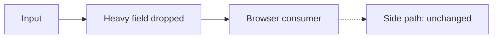

<!--
Format contract (applies to every section):
- Telegraphic. Sacrifice grammar for concision (M. Pocock): fragments, verbs, no fillers
  ("in order to", "it should be noted", "basically"), one idea per line.
- Diagram-first. Structure is drawn: flowchart for shape/data flow, sequenceDiagram only
  when an over-time exchange matters. Caption each diagram with the question it answers.
- Tables only for enumerable data (fields in/out, files, measured numbers). Never for prose.
- One fact, one place. Point at detail; never restate it.
- Section budget: Context ≤ 10 lines, a phase ≤ 8 bullets. Doesn't fit → split the plan
  or move detail to the engine it points at.
-->

# <Title>

## Goal

<!-- 1-2 lines: the end state, no rationale, no approach. -->
<what "done" looks like>

## Context

<!-- Verified facts only, one line each, with sources: paths, hashes, tickets, measurements. -->
<!-- Locked decisions carry date + approval source. Unverified numbers are labeled hypothesis. -->
- <fact — source>
- <fact — source>

## Architecture

<!-- Exactly ONE flowchart LR of the change: inputs → transformation → consumers. -->
<!-- Dotted arrows = untouched paths. Caption = the question the drawing answers. -->

Caption: what crosses the boundary, what stays put.

## Approach — phases

<!-- Numbered, independently testable, nothing backward-dependent. Each phase: -->
<!-- imperatives + decisions it locks + files; ends with `Gate: <runnable proof>`. -->
<!-- A phase may carry its own small diagram when its internal shape matters. -->

### 1. <verb phrase>

- <deliverable>
- <decision locked>

Gate: <check that proves it>

## Files touched

| Area | Files |
| --- | --- |
| <area> | <> |

<!-- Boundary statement: what is explicitly NOT touched. -->

## Open questions

<!-- Unresolved questions surface here, before code (M. Pocock). Resolve with the user -->
<!-- before phase 1. One line per question, then the default if it goes unanswered. -->
- <question> — default: <answer>

## Steps

<!-- LAST planned section (terminal view lands here). Concrete, ordered, ≤ 12; -->
<!-- one step = one reviewable unit, starts with a verb. Never restated from phases. -->

1. <step>

## Verification

<!-- Filled during execution, never pre-written: one row per phase gate. -->
<!-- Append dated record blocks below for probes/decisions/outcomes; still telegraphic. -->

| Gate | Result | Status |
| --- | --- | --- |
