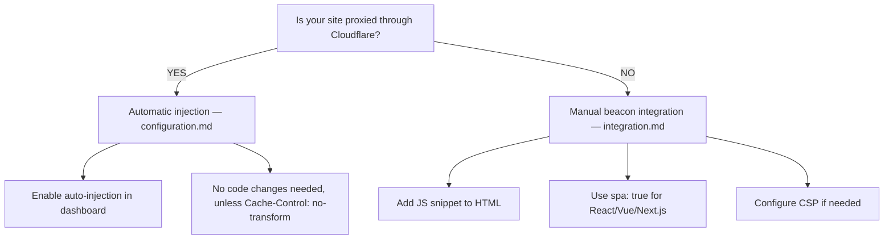

# Cloudflare Web Analytics

Privacy-first web analytics providing Core Web Vitals, traffic metrics, and user insights without compromising visitor privacy.

## Overview

Cloudflare Web Analytics provides:
- **Core Web Vitals** - LCP, FID, CLS, INP, TTFB monitoring
- **Page views & visits** - Traffic patterns without cookies
- **Referrers & paths** - Traffic sources and popular pages
- **Device & browser data** - User agent breakdown
- **Geographic data** - Country-level visitor distribution
- **Privacy-first** - No cookies, fingerprinting, or PII collection
- **Free** - No cost, unlimited pageviews

**Important:** Web Analytics is **dashboard-only**. No API exists for programmatic data access.

## Quick Start Decision Tree



## Reading Order

1. **[configuration.md](configuration.md)** - Setup for proxied vs non-proxied sites
2. **[integration.md](integration.md)** - Framework-specific beacon integration (React, Next.js, Vue, Nuxt, etc.)
3. **[patterns.md](patterns.md)** - Common use cases (performance monitoring, GDPR consent, multi-site tracking)
4. **[gotchas.md](gotchas.md)** - Troubleshooting (SPA tracking, CSP issues, hash routing limitations)

## When to Use Each File

- **Setting up for first time?** → Start with configuration.md
- **Using React/Next.js/Vue/Nuxt?** → Go to integration.md for framework code
- **Need GDPR consent loading?** → See patterns.md
- **Beacon not loading or no data?** → Check gotchas.md
- **SPA not tracking navigation?** → See integration.md for `spa: true` config

## Key Concepts

### Proxied vs Non-Proxied Sites

| Type | Description | Beacon Injection | Limit |
|------|-------------|------------------|-------|
| **Proxied** | DNS through Cloudflare (orange cloud) | Automatic or manual | Unlimited |
| **Non-proxied** | External hosting, manual beacon | Manual only | 10 sites max |

### SPA Mode

**Critical for modern frameworks:**
```json
{"token": "YOUR_TOKEN", "spa": true}
```

Without `spa: true`, client-side navigation (React Router, Vue Router, Next.js routing) will NOT be tracked. Only initial page loads will register.

### CSP Requirements

If using Content Security Policy, use the complete example in [integration.md](integration.md) — the beacon needs both `script-src` and `connect-src` permissions; a `script-src`-only policy blocks event delivery under a restrictive `connect-src`.

## Features

### Core Web Vitals Debugging
- **LCP (Largest Contentful Paint)** - Identifies slow-loading hero images/elements
- **FID (First Input Delay)** - Interaction responsiveness (legacy metric)
- **INP (Interaction to Next Paint)** - Modern interaction responsiveness metric
- **CLS (Cumulative Layout Shift)** - Visual stability issues
- **TTFB (Time to First Byte)** - Server response performance

Dashboard shows top 5 problematic elements with CSS selectors for debugging.

### Traffic Filters
- **Bot filtering** - Exclude automated traffic from metrics
- **Date ranges** - Custom time period analysis
- **Geographic** - Country-level filtering
- **Device type** - Desktop, mobile, tablet breakdown
- **Browser/OS** - User agent filtering

### Rules (Advanced - Plan-dependent)

Create custom tracking rules for advanced configurations:

**Sample Rate Rules:**
- Reduce data collection percentage for high-traffic sites
- Example: Track only 50% of visitors to reduce volume

**Path-Based Rules:**
- Different behavior per route
- Example: Exclude `/admin/*` or `/internal/*` from tracking

**Host-Based Rules:**
- Multi-domain configurations
- Example: Separate tracking for staging vs production subdomains

**Availability:** Rules feature depends on your Cloudflare plan. Check dashboard under Web Analytics → Rules to see if available. Free plans may have limited or no access.

## Plan Limits

| Feature | Free | Notes |
|---------|------|-------|
| Proxied sites | Unlimited | DNS through Cloudflare |
| Non-proxied sites | 10 | External hosting |
| Pageviews | Unlimited | No volume limits |
| Data retention | 6 months | Rolling window |
| Rules | Plan-dependent | Check dashboard |

## Privacy & Compliance

- **No cookies** - Zero client-side storage
- **No fingerprinting** - No tracking across sites
- **No PII** - IP addresses not stored
- **GDPR-friendly** - Minimal data collection
- **CCPA-compliant** - No personal data sale

**EU opt-out:** Dashboard option to exclude EU visitor data entirely.

## Limitations

- **Dashboard-only** - No API for programmatic access
- **No real-time** - 5-10 minute data delay
- **No custom events** - Automatic pageview/navigation tracking only
- **History API only** - Hash-based routing (`#/path`) not supported
- **No session replay** - Metrics only, no user recordings
- **No form tracking** - Page navigation tracking only

## See Also

- [Cloudflare Web Analytics Docs](https://developers.cloudflare.com/analytics/web-analytics/)
- [Core Web Vitals Guide](https://web.dev/vitals/)
- [GraphQL Analytics API Reference](../graphql-api/) - Query server-side analytics (HTTP, Workers, DNS, Firewall, etc.) via GraphQL
