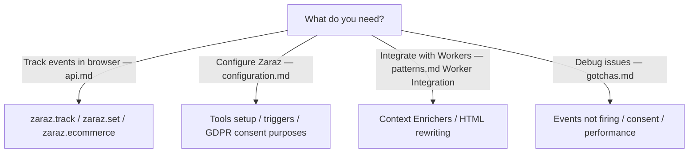

# Cloudflare Zaraz

Expert guidance for Cloudflare Zaraz - server-side tag manager for loading third-party tools at the edge.

## What is Zaraz?

Zaraz offloads third-party scripts (analytics, ads, chat, marketing) to Cloudflare's edge, improving site speed, privacy, and security. Zero client-side performance impact.

**Core Concepts:**
- **Server-side execution** - Scripts run on Cloudflare, not user's browser
- **Single HTTP request** - All tools loaded via one endpoint
- **Privacy-first** - Control data sent to third parties
- **No client-side JS overhead** - Minimal browser impact

## Quick Start

1. Navigate to domain > Zaraz in Cloudflare dashboard
2. Click "Start setup"
3. Add tools (Google Analytics, Facebook Pixel, etc.)
4. Configure triggers (when tools fire)
5. Add tracking code to your site:

```javascript
// Track page view
zaraz.track('page_view');

// Track custom event
zaraz.track('button_click', { button_id: 'cta' });

// Set user properties
zaraz.set('userId', 'user_123');
```

## When to Use Zaraz

**Use Zaraz when:**
- Adding multiple third-party tools (analytics, ads, marketing)
- Site performance is critical (no client-side JS overhead)
- Privacy compliance required (GDPR, CCPA)
- Non-technical teams need to manage tools

**Use Workers directly when:**
- Building custom server-side tracking logic
- Need full control over data processing
- Integrating with complex backend systems
- Zaraz's tool library doesn't meet needs

## In This Reference

| File | Purpose | When to Read |
|------|---------|--------------|
| [api.md](./api.md) | Web API, zaraz object, consent methods | Implementing tracking calls |
| [configuration.md](./configuration.md) | Dashboard setup, triggers, tools | Initial setup, adding tools |
| [patterns.md](./patterns.md) | SPA, e-commerce, Worker integration | Best practices, common scenarios |
| [gotchas.md](./gotchas.md) | Troubleshooting, limits, pitfalls | Debugging issues |

## Reading Order by Task

| Task | Files to Read |
|------|---------------|
| Add analytics to site | README → configuration.md |
| Track custom events | README → api.md |
| Debug tracking issues | gotchas.md |
| SPA tracking | api.md → patterns.md (SPA section) |
| E-commerce tracking | api.md `zaraz.ecommerce()` → patterns.md E-commerce Funnel |
| Worker integration | patterns.md#worker-integration |
| GDPR compliance | api.md `zaraz.consent` → configuration.md Consent Management |

## Decision Tree



## Key Features

- **100+ Pre-built Tools** - GA4, Facebook, Google Ads, TikTok, etc.
- **Zero Client Impact** - Runs at Cloudflare's edge, not browser
- **Privacy Controls** - Consent management, data filtering
- **Custom Tools** - Build Managed Components for proprietary systems
- **Worker Integration** - Enrich context, compute dynamic values
- **Debug Mode** - Real-time event inspection

## Reference

- [Zaraz Docs](https://developers.cloudflare.com/zaraz/)
- [Web API](https://developers.cloudflare.com/zaraz/web-api/)
- [Managed Components](https://developers.cloudflare.com/zaraz/advanced/load-custom-managed-component/)

---

This skill focuses exclusively on Zaraz. For Workers development, see `skills/workers-best-practices/SKILL.md`.
